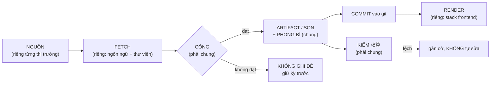

# Kiến trúc 3 thị trường — cái gì CHUNG, cái gì RIÊNG

> Đo ngày **2026-09-30** trên code đang chạy, không phải theo thiết kế mong muốn.
> Mọi con số dưới đây đếm được lại bằng `tools/check.py`, `tools/validate.py`,
> `tools/contrast.py`, `tools/pillar_guard.py`.
> Khi tài liệu này lệch với code, **code đúng** — và hãy sửa tài liệu.

---

## 0. Bức tranh một dòng

**Có 2 thị trường đang chạy, không phải 3.** US chỉ tồn tại như **bối cảnh vĩ
mô bên trong pipeline VN** (`dxy`, `fgUs`, `usYields`) — không có repo, không
có pipeline, không có trang riêng. Mọi thiết kế dưới đây nhắm tới việc thêm US
là **thêm một file cấu hình**, không phải mở một dự án.

---

## 1. Xương sống chung — mọi sản phẩm dữ liệu đều đi đúng đường này



Bốn cổng bắt buộc ở bước **C**, và đây chính là phần **dùng lại được 100%**:

| cổng | câu hỏi nó trả lời | hỏng thì sao |
|---|---|---|
| **độ phủ** | lấy được bao nhiêu phần của tập đích? | "tổng ngành" thiếu nửa số mã mà không ai biết |
| **session-advance** | nguồn đã sang kỳ mới chưa? | ghi đè dữ liệu tốt bằng dữ liệu cũ hơn |
| **đẳng thức tại nguồn** | `giá/EPS` có ra `PER` nguồn công bố không? | đọc nhầm cột, số vẫn "hợp lý" |
| **idempotent theo kỳ** | chạy lại có tạo dòng trùng không? | lịch sử có hai dòng cùng ngày, khác số |

---

## 2. Ma trận: thị trường × công đoạn — CHUNG hay RIÊNG

Ký hiệu: **C** = dùng chung được (và nên chung) · **R** = buộc phải riêng ·
**⚠** = đang riêng nhưng *lẽ ra* phải chung.

| công đoạn | VN | JP | US (chưa có) | kết luận |
|---|---|---|---|---|
| Nguồn dữ liệu | HOSE/HNX · VCI · VCB · Yahoo · Treasury | JPX · 株探 · Yahoo!JP · EDINET | — | **R** — bản chất khác nhau |
| Lịch giao dịch, tiền tệ, đơn vị | ICT, tỷ VND | JST, 億円 | EST, USD | **R** → đưa vào `profiles/*.json` |
| Ngôn ngữ fetch | Python stdlib + (pandas/vnstock) | Python stdlib · Node/TS | — | **R** — và đừng ép chung |
| **Phong bì artifact** | 6 kiểu khác nhau | | | **⚠ → `contract/envelope.schema.json`** |
| **Bốn cổng ở §1** | mỗi repo tự cài một tập con | | | **⚠ → `tools/`** |
| **Cờ `quality`** | 19 file | kiyohara **0** · jp-dash 2 | | **⚠** |
| **Lớp 検算** | 1 file | kiyohara **10** · jp-dash 1 | | **⚠** — ngược chiều ô trên |
| **Loại ngày đang tính** | 3 file | **0** | | **⚠** |
| **Nhân điểm số** (percentile, band, verdict) | chỉ VN có | không có | | **⚠ → `tools/scores.py`** |
| Hiển thị (frontend) | Vite + React 18 JS thuần | TanStack Start + React 19 TS | — | **R** — nhưng *hợp đồng* đọc vào phải chung |
| **Nhãn độ tươi trên UI** | 6/7 trang | 2/4 trang | | **⚠** |
| **Bảng màu đạt WCAG** | 25 cặp trượt | 1 cặp trượt | | **⚠ → `tools/contrast.py`** |
| Luật (skill, pillar) | | | | **C** — đã chung ở `stock-shared/skills/` |
| Hook cưỡng chế | | | | **C** — đã chung, 6 hook × 5 repo |

**Đọc ma trận này theo cột `⚠`:** tám dòng. Đó là toàn bộ khoảng cách giữa
"reusable 100%" và hiện trạng. Không dòng nào trong đó *buộc* phải riêng —
chúng riêng vì được viết ở ba thời điểm khác nhau bởi ba lần suy nghĩ khác nhau.

---

## 3. Ma trận: pillar nào đã cài ở đâu

Số = số file code có khái niệm đó (`git ls-files`, chỉ `.py/.ts/.tsx/.js/.jsx`).

| pillar | vn-market-site | kiyohara | jp-market-dashboard |
|---|---|---|---|
| (tổng file code) | 61 | 32 | 3 |
| `quality` flag `live/proxy/stale/missing` | **19** | **0** ✗ | 2 |
| 検算 / đẳng thức đường tính thứ hai | 1 | **10** | 1 |
| loại ngày đang tính (chống look-ahead) | **3** | **0** ✗ | **0** ✗ |
| upsert lịch sử theo kỳ (idempotent) | **6** | **0** ✗ | 2 |
| cổng độ phủ | 2 | **8** | 1 |
| percentile / z-score | **5** | 0 | 0 |
| retry/backoff khi fetch | 2 | 2 | 0 |

**Hình mẫu duy nhất đáng nhớ:** mỗi repo mạnh đúng chỗ hai repo kia yếu.
kiyohara giỏi 検算 và cổng độ phủ nhưng **không có khái niệm `quality` nào**;
VN giỏi `quality`/look-ahead/lịch sử nhưng chỉ có **1** file 検算. Đây không
phải chuyện phong cách — đó là bằng chứng luật đang được **chép lại** thay vì
**dùng chung**.

---

## 4. Ma trận: nguồn dữ liệu theo thị trường

| thị trường | sản phẩm | nguồn | nhịp | phụ thuộc | artifact |
|---|---|---|---|---|---|
| VN | `vn-core` | Yahoo · US Treasury · VCB · HNX | ngày | stdlib | `live.json` · `world-live.json` · `news-raw.json` · `last-run.json` · `history/*.jsonl` |
| VN | `vn-bonds` | HNX đấu thầu TPCP | tuần | stdlib | `vn-bond-auctions.jsonl` |
| VN | `vn-vnstock` | VCI (qua `vnstock`) | ngày | **pandas + vnstock** | `sector-flows.json` · `cashout-vn.json` · `vn-insight.json` · `regime.json` |
| JP | `jp-flow` | Yahoo chart API | tuần | node stdlib | `flow-latest.json` |
| JP | `jp-valuation` | **株探** `/stock/finance` · Yahoo!JP (tra lẻ) | ngày | node stdlib | `snapshots-kabutan-latest.json` |
| JP | `jp-universe` | JPX 上場銘柄一覧 | tháng | stdlib | `universe.ts` |
| JP | `jp-fx-roles` | EDINET + Jev | tháng | stdlib + Jev | `fx-roles.ts` · `edinet-index.json` |
| JP | `jp-dashboard` | Yahoo!JP 売買代金ランキング | ngày | stdlib | `jp-market.json` |
| JP | `jp-investor` | JPX 投資部門別 `.xls` | **tuần** | stdlib + `xls_reader` tự viết | `jp-investor.json` |
| US | — | — | — | — | **không có** |

**Điểm chung duy nhất giữa hai thị trường:** cả hai đều dùng Yahoo, nhưng
**hai endpoint khác nhau, hai cách chặn khác nhau**. Yahoo JP chặn sau ~85 mã;
Yahoo chart API thì không. Kinh nghiệm không chuyển được giữa hai bên — đó là
lý do `skills/market-data-sources` phải ghi từng endpoint một.

---

## 5. Ma trận: bề mặt hiển thị

### VN — `vn-market-site`, 7 entry Vite, **7/7 có nội dung**

| trang | file | đọc | có nhãn độ tươi |
|---|---|---|---|
| `index.html` Bảng điện | `dashboardEngine.js` | `live.json` · `history/*.jsonl` · `news.json` | ✓ |
| `the-gioi.html` Thế giới | `worldEngine.js` | `world-live.json` | ✓ |
| `lich-su.html` Lịch sử | `historyEngine.js` | `history/index.json` + `{year}.jsonl` · `events.json` | ✓ |
| `dong-tien-cashout.html` | `cashoutEngine.js` | `cashout-vn.json` | ✓ |
| `dong-tien-nganh.html` | `sectorFlowsEngine.js` | `sector-flows.json` | ✓ |
| `buc-tranh-thi-truong.html` Regime | `RegimeApp.jsx` | `regime.json` | ✓ |
| `huong-dan-doc.html` Hướng dẫn | `GuideApp.jsx` | — (chữ tĩnh) | n/a |

### JP — `kiyohara`, 5 route, **2 trang có dữ liệu thật**

| route | dòng | trạng thái |
|---|---|---|
| `/trade` 輸出入 | 263 | **thật** — `flow-latest.json` + `fx-roles` |
| `/agent` 検算 | 131 | **thật** — kiểm lại mọi số từ dữ liệu thô |
| `/` | 19 | trang chủ, link sang `/trade` |
| `/flow` · `/rotation` | 20 mỗi | **placeholder trung thực**: *"Chưa dựng… Để trống có chủ đích — thà rỗng còn hơn điền số mẫu trông như thật."* |

> **Đính chính.** Bản soát UI đầu tiên của tôi ghi `/flow` và `/rotation`
> "hiện số tiền mà không có `as of` lẫn nguồn" — **sai**. Chúng không hiện số
> nào cả và nói rõ là chưa dựng. Đó là hành vi ĐÚNG theo pillar. Việc cần làm
> ở hai route đó là **dựng**, không phải **sửa**.
> Spec `kiyohara/docs/PRODUCT.md` khai 13 route; hiện có 4.

### JP — `jp-market-dashboard`: một file HTML, chưa tách design token.

---

## 6. Phép thử "thêm US" — thước đo của reusable

Muốn biết kiến trúc đã đủ dùng lại chưa, đặt câu hỏi: **thêm thị trường US
phải chạm bao nhiêu chỗ?**

| việc | hôm nay | sau khi xong kế hoạch |
|---|---|---|
| khai lịch/tiền tệ/đơn vị/nguồn | không có chỗ nào để khai | `profiles/us.json` — **1 file** |
| viết fetcher | 1 script mới | 1 script mới *(không tránh được — nguồn thật sự khác)* |
| phong bì artifact | tự nghĩ ra kiểu thứ 7 | dùng `envelope/1` — **0 dòng** |
| bốn cổng | chép tay từ repo gần nhất | gọi `tools/` — **0 dòng** |
| điểm số / verdict | viết lại công thức | `tools/scores.py` — **0 dòng**, percentile tự thích nghi |
| kiểm độ tươi + CI | không có | `check.py` tự nhận — **0 dòng** |
| nhãn `as of` + nguồn trên UI | tự làm lại | component đọc `_envelope.period` |

Hôm nay: **7/7 việc phải làm lại**. Đích: **2/7** (fetcher + một file profile).

Con số này là thước đo kiểm được, không phải khẩu hiệu — và nó cũng chính là
lý do `profiles/us.json` được viết **trước khi** có pipeline US: nó chứng minh
phần còn lại thật sự không cần viết lại.

---

## 7. Vì sao chia sẻ HỢP ĐỒNG, không chia sẻ THƯ VIỆN

Ba runtime thật sự khác nhau: Python stdlib (VN, jp-dashboard) · Node/TypeScript
(kiyohara) · CrewAI (nghiên cứu JP). Ép chúng dùng chung **code** thì hoặc phải
viết ba bản của mỗi thư viện — và ba bản sẽ lệch nhau, đúng như 9 agent JP đang
tồn tại ba bản — hoặc phải gộp stack, tức viết lại cả hệ.

Nhưng **artifact đều là JSON**, bất kể ai ghi ra. Nên thứ dùng lại được 100% là:

```
contract/envelope.schema.json   ← hình dạng dữ liệu
tools/validate.py               ← cưỡng chế hình dạng đó
tools/scores.py                 ← phép tính trên dữ liệu đó
tools/contrast.py               ← luật hiển thị (màu không phụ thuộc thị trường)
tools/check.py                  ← giám sát
skills/                         ← phương pháp (đã chung)
hooks/                          ← cưỡng chế lúc viết code (đã chung)
profiles/{vn,jp,us}.json        ← PHẦN CUSTOMIZE, và chỉ chừng này
```

Một công cụ Python đọc được artifact của cả ba stack. Đó là toàn bộ mẹo.

---

## 8. Ba chỗ đang nhân bản — nợ phải trả

| thứ | số bản | ở đâu |
|---|---|---|
| Hệ 9 agent sàng lọc JP | **3** | subagent Claude `.md` (repo VN) · CrewAI `jp_value_screen_graph/` (**repo VN**) · `.jsonc` (repo `jp_stock_undervaluation`) |
| Màu ngữ nghĩa của VN | **2** | `tokens.css` và 13 hex cứng trong `dashboardEngine.js`, trong đó 5 màu **không có** trong token |
| Danh sách "cấm sửa tay" | đã trả | trước đây chép tay trong CLAUDE.md và **thiếu 3 file**; nay sinh từ `registry.json` |

README của chính `jp_value_screen_graph` viết: *"cả hai chạy độc lập — sửa cái
này thì phải sửa cái kia"*. Một câu thành thật, và cũng là định nghĩa của
không-reusable.

---

## 9. Đọc tiếp

- `registry.json` — nguồn sự thật máy đọc được cho mọi bảng ở trên
- `contract/envelope.schema.json` — phong bì, kèm lý do từng trường
- `skills/data-integrity-pillars` — luật `SD`
- `skills/market-data-sources` — endpoint nào chạy, endpoint nào đã LOẠI và vì sao
- kế hoạch thi công hiện hành: `~/.claude/plans/merry-pondering-hare.md`
